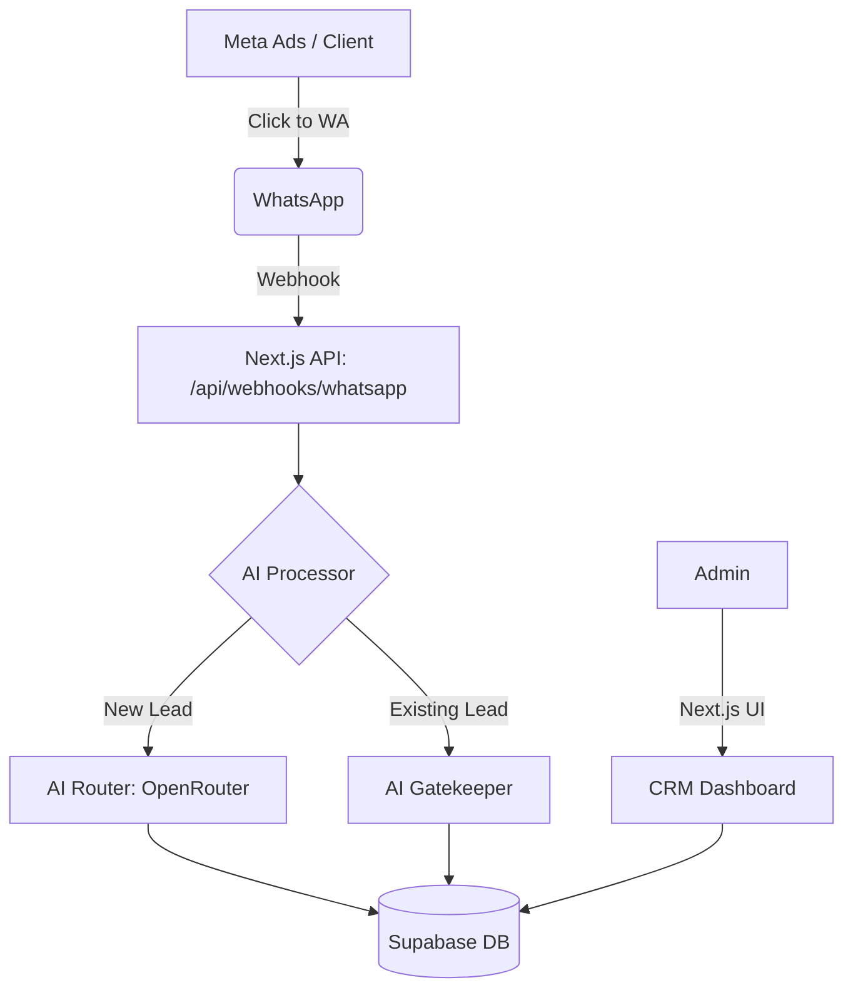

# 01 - Architecture

```mermaid
graph TD;
    A[Meta Ads / Client] -->|Click to WA| B(WhatsApp)
    B -->|Webhook| C[Next.js API: /api/webhooks/whatsapp]
    C --> D{AI Processor}
    D -->|New Lead| E[AI Router: OpenRouter]
    D -->|Existing Lead| F[AI Gatekeeper]
    E --> G[(Supabase DB)]
    F --> G
    H[Admin] -->|Next.js UI| I[CRM Dashboard]
    I --> G
```

*   **Vercel Serverless Quirks**: Background tasks (`setTimeout`) are immediately frozen. Processing must be awaited synchronously or handled via Vercel Edge functions.
