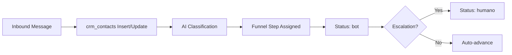

# 04 - CRM Flow

The CRM is accessible via the Next.js frontend at `/hq`. Manual advances via the UI trigger `/api/crm/contacts/[id]/route.ts` which correctly resolves the WhatsApp JID from conversation history.
