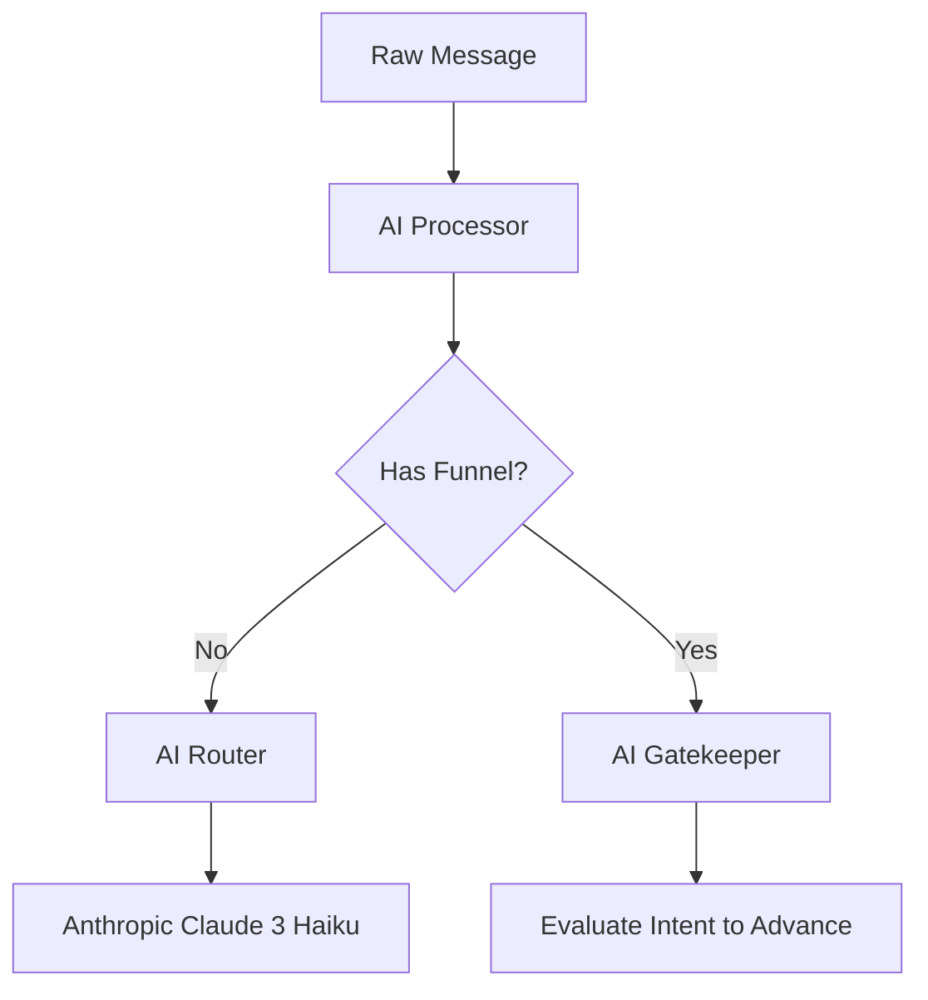

# 06 - AI System

*   **Router**: Located in `lib/ai/router.ts`. Uses `OPENROUTER_MODEL`.
*   **Gatekeeper**: Evaluates if the user's intent fulfills the requirement to advance to the next funnel step.
